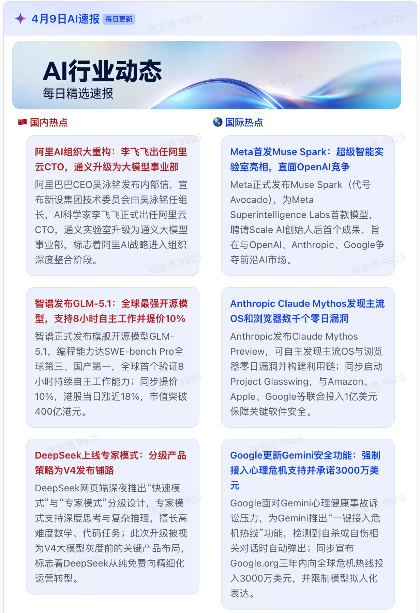

# AI Daily News

每日自动搜索 AI 行业热点新闻（国内外各 3 条），通过飞书机器人推送精美卡片消息。借鉴 Harness 工程理念，在发送前执行**八层校验**，确保新闻链接真实、格式规范。

## 特性

### 通用特性
- 🔍 **智能搜索**：多轮搜索策略，覆盖主流 AI 新闻源
- ✅ **八层校验**：发送前自动验证，杜绝虚假链接和格式错误
- 📱 **飞书卡片**：左右双栏布局，国内/国际新闻分区展示

### Claude Code Skill 版本特性
- 📅 **定时任务**：支持 Claude Code Routines 定时触发
- 🔄 **自动同步**：推送完成后自动将日志推送到 Git 仓库

### 飞书优化版特性（推荐）
- 🎯 **精准来源**：指定 12 个国内优质 AI 新闻源，避免搜索结果偏差
- 🛡️ **增强校验**：针对飞书 Aily 智能体特点优化，增加 URL 路径特征检查、今日头条拦截等校验层
- 🤖 **Aily 原生**：可直接导入飞书 Aily 平台，一键部署智能体
- 📋 **运行日志**：通过 Aily 查看历史推送记录，方便追溯和审计

## 项目版本说明

本项目包含两个 Skill 版本：

| 版本 | 路径 | 特点 |
|------|------|------|
| **Claude Code Skill** | `.claude/skills/ai-daily-news/` | 原始版本，支持 Routines 定时运行 + 自动 Git 同步 |
| **飞书优化版** | `ai-daily-news-feishu/` | 增强版本，12 个指定国内来源 + 8 层校验，**支持飞书 Aily 智能体** |

**推荐使用飞书优化版**（`ai-daily-news-feishu/`），它提供了更严格的新闻质量保障。

### 飞书 Aily 智能体集成

飞书优化版 Skill 是专门为**飞书 Aily 智能体**优化的，可以直接导入使用：

1. 将 `ai-daily-news-feishu/` 文件夹压缩为 ZIP 包
2. 在飞书 Aily 平台选择「导入技能」
3. 上传 ZIP 包即可完成部署

导入后，Aily 智能体可以直接调用该 Skill 执行 AI 新闻搜索和推送任务。

## 工作原理

```
┌─────────────────────────────────────────────────────────────┐
│  触发方式                                                    │
│  ├── Claude Code Routines (定时触发，推荐)                    │
│  ├── Claude Code Skill (自然语言触发)                         │
│  └── 独立脚本调用 (命令行/其他定时任务)                        │
└─────────────────────────────────────────────────────────────┘
                            │
                            ▼
┌─────────────────────────────────────────────────────────────┐
│  搜索阶段                                                    │
│  ├── 国外搜索 (至少 5 轮)                                      │
│  └── 国内搜索 (飞书版：12 个指定网站 / 原版：多轮搜索)          │
└─────────────────────────────────────────────────────────────┘
                            │
                            ▼
┌─────────────────────────────────────────────────────────────┐
│  八层校验 (validate-news.py)                                 │
│  1. JSON Schema 校验                                         │
│  2. 日期校验 (北京时间昨天)                                    │
│  3. 今日头条拦截                                             │
│  4. URL 路径特征检查 (拦截分类页/搜索页)                        │
│  5. 来源集中度检查                                            │
│  6. 跨分区查重                                                │
│  7. 链接可达性检查                                            │
│  8. 页面日期交叉验证                                          │
└─────────────────────────────────────────────────────────────┘
                            │
                            ▼
┌─────────────────────────────────────────────────────────────┐
│  飞书推送 (send-ai-news.sh)                                  │
│  └── 生成精美卡片消息 → 推送至群聊                            │
└─────────────────────────────────────────────────────────────┘
                            │
                            ▼
┌─────────────────────────────────────────────────────────────┐
│  自动 Git 同步 (仅 Claude Code Skill 版本)                      │
│  ├── 推送成功后自动 commit 新闻日志                            │
│  ├── 推送到指定 Git 仓库                                      │
│  └── 云端运行自动创建 PR 并合并到 main                          │
└─────────────────────────────────────────────────────────────┘
```

## 项目结构

```
ai-daily-news/
├── .claude/skills/ai-daily-news/   # Claude Code Skill 版本
│   ├── SKILL.md                    # Skill 定义（原始版）
│   ├── .env.example                # 环境变量模板
│   ├── .env                        # 实际配置（不会提交）
│   ├── logs/                       # 新闻日志
│   └── scripts/
│       ├── send-ai-news.sh         # 飞书推送脚本（含 Git 同步）
│       └── validate-news.py        # 校验脚本
│
├── ai-daily-news-feishu/           # 飞书优化版本（推荐）
│   ├── SKILL.md                    # Skill 定义（增强版）
│   ├── .env.example                # 环境变量模板
│   ├── logs/                       # 新闻日志 (按月存储)
│   └── scripts/
│       ├── send-ai-news.sh         # 飞书推送脚本
│       └── validate-news.py        # 八层校验脚本（增强版）
│
├── README.md                       # 本说明文档
├── LICENSE
└── .gitignore
```

## 快速开始

### 方式一：作为 Claude Code Skill 使用（推荐飞书优化版）

#### 1. 安装 Skill

```bash
# 用户级别（所有项目可用）
git clone https://github.com/JexZhang/ai-daily-news.git ~/.claude/skills/ai-daily-news-repo

# 或项目级别（仅当前项目可用）
git clone https://github.com/JexZhang/ai-daily-news.git .claude/skills/ai-daily-news-repo
```

#### 2. 配置飞书 Webhook

在飞书群聊中添加自定义机器人，获取 Webhook 地址：

```bash
# 使用飞书优化版（推荐）
cd ~/.claude/skills/ai-daily-news-repo/ai-daily-news-feishu
cp .env.example .env
# 编辑 .env，填入你的 FEISHU_WEBHOOK 地址

# 或使用原始版本（支持 Git 同步）
cd ~/.claude/skills/ai-daily-news-repo/.claude/skills/ai-daily-news
cp .env.example .env
# 编辑 .env，填入 FEISHU_WEBHOOK 和 GIT_REPO_URL
```

#### 3. 配置定时任务（Claude Code Routines）

在 Claude Code 中设置定时任务，每天早 9 点自动执行：

```
每天工作日早 9 点执行 ai-daily-news skill，推送 AI 新闻到飞书
```

Routines 会自动：
- 在云端定时触发 Skill
- 执行新闻搜索和推送
- 推送完成后自动将日志 commit 并推送到指定 Git 仓库
- 如在工作分支运行，会自动创建 PR 并合并到 main

#### 4. 使用

在 Claude Code 中输入：

> 帮我执行 ai-daily-news-feishu skill，推送昨天的 AI 新闻到飞书

### 方式二：独立脚本调用

#### 1. 准备环境

```bash
cd ai-daily-news/ai-daily-news-feishu
cp .env.example .env
# 编辑 .env，填入你的 FEISHU_WEBHOOK 地址
chmod +x scripts/send-ai-news.sh
```

#### 2. 准备新闻 JSON

创建新闻文件（如 `news.json`）：

```json
{
  "chi": [
    {
      "title": "阿里通义千问 Qwen3.5 开源",
      "summary": "阿里达摩院发布 Qwen3.5 系列模型，在多项基准测试中表现优异...",
      "url": "https://example.com/news1",
      "date": "2026-04-19"
    }
  ],
  "foreign": [
    {
      "title": "Google 发布 Gemma 4 开源模型",
      "summary": "Google DeepMind 正式发布 Gemma 4 系列，性能大幅提升...",
      "url": "https://example.com/news2",
      "date": "2026-04-19"
    }
  ]
}
```

#### 3. 发送新闻

```bash
./scripts/send-ai-news.sh /path/to/news.json
```

## 校验脚本详解

`validate-news.py` 执行八层自动校验，确保新闻质量：

| 校验层 | 检查内容 | 示例错误 |
|--------|----------|----------|
| 1. JSON Schema | 结构、必填字段、类型、长度 | 缺少 title 字段 |
| 2. 日期校验 | date 必须等于北京时间昨天 | date 为 2026-04-18 |
| 3. 今日头条拦截 | 禁止 toutiao.com 链接 | url 包含 toutiao.com |
| 4. URL 路径特征 | 拦截分类页/搜索页/列表页 | /search/, /category/ |
| 5. 来源集中度 | 同一网站不得≥3 条 | 3 条来自 qbitai.com |
| 6. 跨分区查重 | 国内外新闻标题重叠度<50% | 描述同一事件 |
| 7. 链接可达性 | HTTP 请求验证链接有效 | 404 Not Found |
| 8. 页面日期验证 | 页面元数据日期匹配 | 页面显示 4 月 17 日 |

单独运行校验：

```bash
python3 scripts/validate-news.py news.json
```

## 新闻筛选标准

### 国内新闻来源（飞书优化版 - 12 个指定网站）

1. 36Kr AI: https://www.36kr.com/information/AI/
2. 量子位: https://www.qbitai.com/category/%e8%b5%84%e8%ae%af
3. 科技日报: https://www.stdaily.com/
4. InfoQ AI: https://www.infoq.cn/topic/AI&LLM
5. 中国青年网科技: https://tech.youth.cn/
6. ChinaDaily 科技: https://www.chinadaily.com.cn/business/tech
7. 中国经济网科技: http://scitech.ce.cn/
8. 央广网科技: https://tech.cnr.cn/
9. 光明网科技: https://tech.gmw.cn/
10. 新华网科技: https://www.news.cn/tech/index.html
11. 智东西: https://www.zhidx.com/p/category/%E4%BA%BA%E5%B7%A5%E6%99%BA%E8%83%BD
12. 人民网财经: http://finance.people.com.cn/

### 热点定义

满足以下至少 2 项：
- 多家主流媒体报道（≥3 家）
- 涉及头部公司或重大技术突破
- 引发公共讨论或政策关注

### 政策新闻优先

重要政策更新（立法、行政令、监管意见等）优先纳入并置顶。

## 飞书卡片效果

- **标题**：自动显示日期（如「4 月 20 日 AI 速报」）
- **布局**：左右双栏，左栏国内（红色）、右栏国际（蓝色）
- **内容**：每条新闻包含标题和 50-80 字摘要
- **交互**：点击卡片跳转新闻原文

### 推送效果截图



> 上图：飞书机器人推送的 AI 新闻卡片示例


## 环境要求

- macOS / Linux
- Python 3.6+
- curl
- git（仅 Git 同步功能需要）
- [Claude Code CLI](https://docs.anthropic.com/en/docs/claude-code)（可选，仅 Skill 模式需要）

## 常见问题

### Q: 两个版本有什么区别？

A: 
- **原始版本**（`.claude/skills/ai-daily-news/`）：使用通用搜索策略，支持 Claude Code Routines 定时运行，推送完成后自动 Git 同步日志
- **飞书优化版**（`ai-daily-news-feishu/`）：针对飞书aily智能体做了优化（网络搜索能力弱，幻觉强），指定 12 个国内来源，增加 8 层校验，新闻质量更有保障；飞书aily定时任务可通过查看运行日志查看推送历史，删除了Git推送功能

### Q: 如何配置定时任务？

A: 在 Claude Code 中使用 Routines 功能，设置定时触发条件。执行指令中直接引用该技能并给出飞书机器人地址，例如："/ai-daily-news skill 我的飞书机器人Webhook地址为：https://open.feishu.cn/open-apis/bot/v2/hook/xxx"。

### Q: Git 同步如何工作？

A: Claude Code Skill 版本在推送成功后，`send-ai-news.sh` 会自动：
1. 将新闻日志 commit 到本地
2. 推送到配置的 Git 仓库
3. 如在云端运行，会自动创建 PR 并合并到 main 分支

### Q: 如何获取飞书 Webhook？

A: 在飞书群聊中，点击右上角菜单 → 机器人 → 添加机器人 → 自定义机器人，复制 Webhook 地址。

### Q: 校验失败如何处理？

A: 校验脚本会输出详细错误报告，智能体根据报告修正 JSON 后重试。内容问题（如链接不可达）需要重新选择新闻，格式问题可直接修改 JSON。

### Q: 如何查看历史新闻？

A: 新闻日志自动保存在对应版本的 `logs/` 目录，飞书优化版按月组织（如 `202604/20260419.json`）。

## License

MIT
